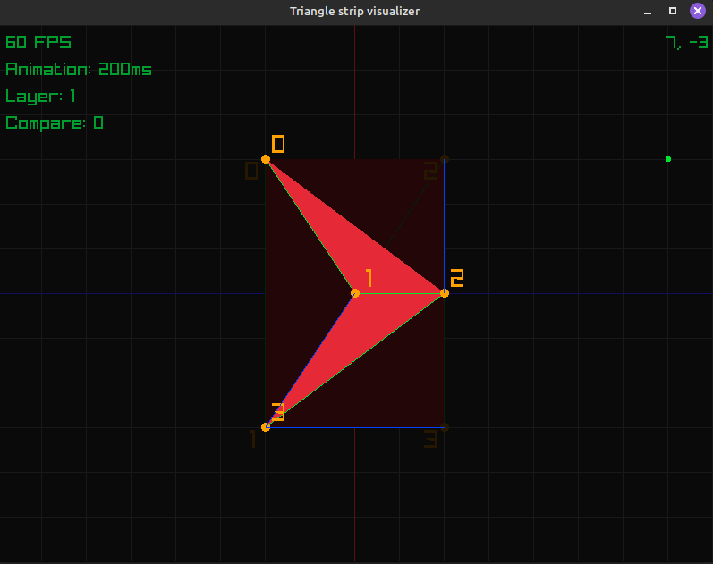

# Tristrip

<p align=center>
  
</p>

A simple visualizer of how triangle strips work in Raylib.

## Usage

To build & run the application:
```console
./build.sh run
```

The following controls are available:
- Click on a grid point to add a point.
- Drag a grid point to move it.
- Right click on a point to remove it.
- Scroll over a grid point to change its position in the triangle strip.
- Left and right arrow keys move between layers. Pressing right on the last layer creates a new one if it has points. Pressing left on the last layer removes it if it has no points.
- Space key toggles the current layer as comparison layer. Pressing it again on the current comparison layer removes the comparison layer.
- A key animates between the active and comparison layers.
- Up anddown arrow keys in-/decrease the animation time.

